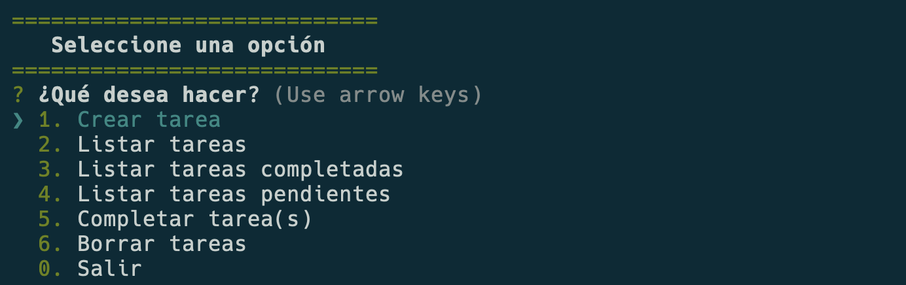

## My personal TODO app in console

This is a console app to record my to-dos



you can install it with the command

```bash
npm install -g @arielscc/todo-cli
```

to use the app run:

```bash
todo
```
