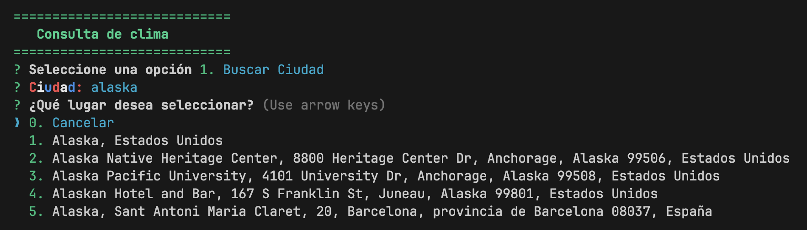

## Console Weather

This is a console app to get the weather anywhere



you can install it with the command

```bash
npm install -g @arielscc/weather
```

For the correct behavior of this package you must use two services:

1. [MapBox](https://www.mapbox.com/)
2. [OpenWeatherMap](https://openweathermap.org/)

You must get two `API_KEYS` and register them to your `.zshrc` or `.bashrc`.

```bash
echo 'export MAPBOX_KEY="MAPBOX_KEY"' >> ~/.zshrc
echo 'export OPEN_WEATHER_KEY="OPEN_WEATHER_KEY"' >> ~/.zshrc
```

To use the app run:

```bash
weather
```
